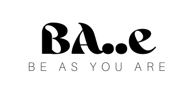

# BA..e(Be As You Are)

This is a Travel booking website inspired from Orbitz.com.

Specifically catering to the LGBTQ+ community.

<b>Live: bae-travel.vercel.app/</b>

 

<i>For accessing admin section, Login with below credentials</i>

Mobile Number: <i>123</i>

Password: <i>123</i>

<h2>Website Logo</h2>

<h2>Functionalities:</h2>
<ul>
  <li> Full-Stack(MERN) application</li>
  <li> Sign-in/Sign-up pages with minimal details to fill</li>
  <li> Sign-in with Forget Password feature</li>
  <li> Authorization through frontend using private routes</li>
  <li> Multi-page Application feature by using routes</li>
  <li> Toast for alerts/feedbacks to the user</li>
  <li> Fully responsive for all screen-sizes</li>
  <li> Debouncing using closure for making API requests</li>
  <li> Handling wrong URL</li>
  <li> Dynamic Routes for single-product page</li>
  <li> Retaining the filterd data even after the reloading of the web-page</li>
  <li> Sorting and Filtering through backend</li>
</ul>

<h2>Tech Stacks used</h2>
<ul>
  <li>React</li>
  <li>HTML/CSS</li>
  <li>JavaScript</li>
  <li>Chakru-UI library</li>
  <li>Express</li>
  <li>Mongo</li>
  <li>NodeJS</li>
</ul>

<h2> Snippets</h2>

  
  

Admin Page

Mobile View

<h2>Backend</h2>

Repo: https://github.com/jagroshansingh/BA..e-BeAsYouAre_Backend

Deployed: https://wicked-mite-tweed-jacket.cyclic.app/

